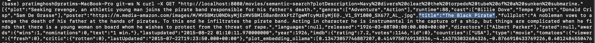

# PG-LLM-World: Advanced Generative AI with Spring AI

## Project Overview

PG-LLM-World is a cutting-edge Java Spring AI application that demonstrates the integration of Generative AI capabilities using Spring AI. This project showcases how to leverage state-of-the-art technologies to create a powerful, scalable, and efficient AI-driven application.

## Project Structure

The project is organized into several modules using a multi-module Gradle setup:

- `llm:api`: Core API module for handling AI requests and responses
- `llm:ollama-provider`: Integration with Ollama for local AI model running
- `llm:hf-provider`: Integration with Hugging Face for accessing state-of-the-art NLP models
- `llm:realtime-data-provider`: Real-time data processing module using Reactive Kafka

The `settings.gradle.kts` file defines the project structure:

```kotlin
rootProject.name = "pg-llm-world"
include("llm:api")
include("llm:ollama-provider")
include("llm:hf-provider")
include("llm:realtime-data-provider")
```
## Technology Stack

Our project utilizes a modern and robust technology stack:

- **Java 22**: Leveraging the latest features of the Java programming language
- **GraalVM**: For enhanced performance and reduced startup time
- **Spring Boot 3.x**: The latest version of the Spring Boot framework
- **Spring AI 0.8.1-SNAPSHOT**: Experimental AI integration library for Spring
- **Spring WebFlux**: Reactive programming model for building efficient, non-blocking applications
- **MongoDB Atlas Vector Database**: For efficient storage and retrieval of vector embeddings
- **Reactive Kafka**: For real-time data streaming and processing
- **Ollama**: Local AI model running capabilities
- **Hugging Face**: Access to state-of-the-art NLP models

## Prerequisites

### Java and GraalVM Setup

1. Install Java 22 and GraalVM on your local machine
2. Set up the appropriate environment variables

### Ollama Setup

1. Install Ollama on your local machine
2. Run the following command to initialize the Llama 3.1 model:

```
ollama run llama3.1
```

### MongoDB Atlas Setup

1. MongoDB Atlas Subscription (Free Tier is fine)
2. Set up a new cluster and obtain the connection string
3. Follow the setup instructions in the [MongoDB Quick Start Guide](https://www.mongodb.com/developer/products/atlas/quickstart-vectorsearch-mongodb-python/)

### Hugging Face Setup

1. Create an account on Hugging Face
2. Generate an API key for accessing Hugging Face models
3. Set up the API key in your environment variables

## Project Configuration

### Spring AI Dependency

```
extra["springAiVersion"] = "0.8.1"

dependencies {
    implementation("org.springframework.boot:spring-boot-starter-data-mongodb-reactive")
    implementation("org.springframework.boot:spring-boot-starter-data-redis-reactive")
    implementation("org.springframework.kafka:spring-kafka")
    implementation("io.projectreactor.kafka:reactor-kafka")
    implementation("org.springframework.boot:spring-boot-starter-webflux")
    implementation("org.springframework.boot:spring-boot-starter-web")
    implementation("org.springframework.ai:spring-ai-ollama-spring-boot-starter")
    implementation("org.springframework.ai:spring-ai-retry:${property("springAiVersion")}")
}
```
### application config

```
spring:
  ai:
    ollama:
      base-url: http://localhost:11434
      chat:
        options:
          model: llama3.1  # Model name, such as llama3.1
          temperature: 0.9  # Temperature setting for controlling randomness in response generation  spring.ai.ollama.chat.options.temperature=0.7

```
```
pg:
  hugging-face:
    url: https://api-inference.huggingface.co/pipeline/feature-extraction/sentence-transformers/all-MiniLM-L6-v2
    token: <TOKEN>
```

## Running the project
This command will start all necessary services and initialize the application.
```bash
make up
```
## Features

### Semantic Search for Movies

One of the standout features of PG-LLM-World is its advanced semantic search capability for movies. This feature demonstrates the power of combining vector databases with natural language processing to provide highly relevant search results.

#### How it Works

1. **Text Processing**: The application takes sample text input from users, which can be movie descriptions, themes, or even abstract concepts related to films.

2. **Vector Embedding**: Using advanced NLP models, the input text is converted into a high-dimensional vector representation, capturing the semantic meaning of the text.

3. **Similarity Search**: The system then performs a similarity search in the MongoDB Atlas Vector Database, comparing the input vector against the vectors of movie documents stored in the database.

4. **Relevant Results**: The search returns a list of movies that are semantically similar to the input text, even if they don't contain exact keyword matches.

#### Sample Output

Here's an example of the semantic search results:



#### Exploring the Data

To get a deeper understanding of the movie data used in this feature:

1. Access the MongoDB Atlas UI
2. Navigate to the `sample_mflix` database
3. Explore the `movies` collection

In this collection, you'll find detailed document structures for each movie, including:
- Title
- Release Year
- Plot Summary
- Cast and Crew Information
- Genre Tags

This rich dataset allows for nuanced semantic searches that can uncover thematic similarities and hidden connections between films.

#### Use Cases

- Film Research: Quickly find movies with similar themes or narrative elements
- Content Recommendation: Suggest films based on abstract descriptions or moods
- Data Analysis: Uncover trends and patterns in film narratives over time

## Future Enhancements

To further improve our system's performance, scalability, and functionality, we plan to implement the following enhancements:

### Next in Pipeline

1. **Advanced Vector Embedding Service**
    - Leverage Sink Connector and Apache Flink as a vector embedding service for better throughput and reduced latency.
    - This will allow us to process and embed large volumes of data in real-time, enhancing our semantic search capabilities.

2. **Guardrails Implementation**
    - Implement guardrails to ensure the safety and reliability of our AI-powered responses.
    - This will help prevent inappropriate or inaccurate information from being presented to users.

3. **Redis Cache Integration**
    - Integrate Redis as a caching layer to improve response times for frequently requested information.
    - This will reduce the load on our main database and provide faster access to commonly searched data.

4. **Langchain4j Integration**
    - Incorporate Langchain4j to enhance our natural language processing capabilities.
    - This will allow for more sophisticated query understanding and response generation.

5. **Kafcongo Synergy**
    - Explore the powerful synergy between Kafka, Confluent, and MongoDB, which we like to call "Kafcongo".
    - This combination will enable us to build a more robust and scalable data pipeline, enhancing our real-time data processing and storage capabilities.

By implementing these enhancements, we aim to create a more efficient, responsive, and intelligent semantic search system for banking products and services. These improvements will allow us to handle larger volumes of data, provide faster and more accurate responses, and offer a more personalized user experience.

## Contributing

We welcome contributions to the PG-LLM-World project. Please feel free to submit issues, feature requests, or pull requests through our GitHub repository. For major changes, please open an issue first to discuss what you would like to change.

## Acknowledgments

- Thanks to the Spring AI team for providing a powerful framework for AI integration
- Kudos to the Ollama, Hugging Face and Open AI teams for their excellent AI model platforms
- Special thanks to the MongoDB team for their vector database capabilities

## References

- [Spring AI Documentation](https://docs.spring.io/spring-ai/reference/)
- [Generative AI with Spring Boot Services](https://dev.to/lucasnscr/generative-ai-with-springboot-services-471l)
- [Building Generative AI Applications in Java](https://www.danvega.dev/blog/ai-java-developers)
- [Mongodb quick start](https://www.mongodb.com/developer/products/atlas/quickstart-vectorsearch-mongodb-python/)